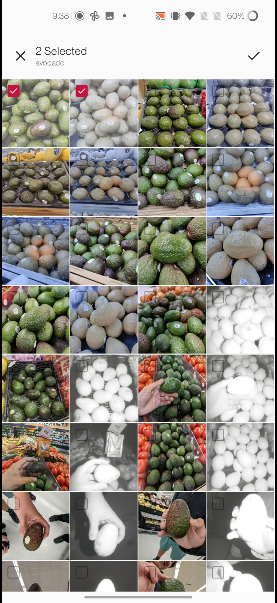

# RipeTrack Application on Android
This application is written in Kotlin for Android phones. It works in two modes: offline and online. The offline mode processes pre-captured images, while the online mode captures and processes the images in real time. The online mode requires a phone that allows accessing the NIR camera. The app allows the user to conduct an in-depth analysis of the hyperspectral bands reconstructed from the input RGB+NIR images. When a user taps on an area in the image, the app will compute and display the spectral signature for the pixels in that area.
 
## Requirements
- Offline mode: Any Android smartphone should work.
- (Optional) Online mode: An Android phone that allows access to the NIR camera, such as Google Pixel 4 XL.

For OnePlus 8 Pro, the camera with NIR information was removed using software due to [privacy concerns](https://www.theverge.com/2020/5/15/21259723/oneplus-8-pro-x-ray-vision-infrared-filter-see-through-plastic). It can be accessed in OxygenOS 11 using [Factory Mode](https://www.xda-developers.com/oneplus-8-pro-color-filter-camera-still-accessible-adb-command/ "How to access Color Filter Camera on OnePlus 8 Pro using adb") or by rooting the phone in OxygenOS 12.

## Install the App
<!--The APK for the application can be downloaded from here: [RipeTrack APK](). There are Information boxes on each screen as textual descriptions which tell the user what to do.-->

Steps for installing the application on your phone are as follows:

- Press the APK file to install the application.
- If the application could not be downloaded, disable Play Protect (a service from Google that prevents users from installing applications that are not from Play Store) on your phone for the time being. To do that, follow the steps below:
	- Open `Google Play Store`.
	- Click your Profile Picture (top right).
	- Open `Play Protect` option and press the Settings Cog (top right).
	- Disable the option `Scan apps with Play Protect`
- After disabling "Play Protect" press APK file and, a pop-up will appear, asking you to allow downloading apps from other sources.
- When the application is installed, the app will ask for permission to access the camera and storage on your phone.
	- Camera Permission: required to capture images using the cameras.
	- Storage Permission: required to save and load images from the disk.
- The application will be installed, and you will reach the Main page of the application.

You can also [build the application from source code](#build-the-application-from-the-source-code).

## Test the Application in Offline Mode
Download one or more of the following Mobile Image [datasets](https://drive.google.com/drive/folders/1oBmib1meInQ5zZzC0itiRDGs5IKJRZPb?usp=drive_link "Dataset URL") to test the application:

- Pear Bosc
- Pear Bartlett
- Avocado Organic
- Avocado Hass
- Banana
- Mango
- Nectarine

The datasets are in pairs of RGB and NIR images. Each dataset has the following directory structure, where `[fruit]` is e.g. pear-bartlett.
```
[fruit]
│
└── [num]_NIR.png
    [num]_RGB.png
    ...
```

Steps to run the application in the offline mode:
1. Unzip the dataset that you downloaded before
2. Run the application
3. Select the offline mode Radio button to be used
	- `mobile-rgbn` is the folder where you can select images
4. Select two corresponding images (RGB and NIR) from the pop-up by tapping
5. An object detection model will attempt to select the region in the middle of the fruit for reconstruction. A new region (bounding box) can be chosen by tapping on the image.
6. Reconstruct the hypercube
7. The application shows the predicted classification label for the fruit (`expired`, `ripe`, or `unripe`) and a progress bar displaying its remaining lifetime.
8. (Optional) Press 'Analyze' to see the reconstructed hyperspectral bands. Tapping on any band will show the spectral signatures for that area in a graph.

The application screenshots below are captured using a smartphone without an NIR camera:

|                                                                            |                                                                                    |                                                                                  |
|:--------------------------------------------------------------------------:|:----------------------------------------------------------------------------------:|:--------------------------------------------------------------------------------:|
|  |                 |                   |
|                                Selecting Offline Mode                               |                               Gallery Opening Intent                               |                              Image Viewer                              |
|          |  |                                                                        |
|                              Reconstructed Hypercube                              |                                   Signature Analysis                                   |                                                                                  |

### Demo for Offline Mode
Here is a [Demo](https://drive.google.com/file/d/1PMBsjny-JkjTvnJGSAHagy6MHpETPYaw/view?usp=sharing "Offline Mode Demo Video 41.2 MBs") of offline mode in effect.

## Test the Application in Online Mode
This mode requires a phone that allows accessing the NIR camera. Most phones with NIR cameras have them on the front because their primary use has so far been face identification. To assist the user in capturing fruit images using front-facing cameras, we added a countdown timer (3 sec) that makes the app issues a beeping sound after it captures the images. The Online mode also makes sure that the scene is well lit before the user can capture any picture.

Steps to run the application in the online mode:
1. Run the application and select online mode radio button.
2. Press the capture button, and turn the phone towards the fruit. It will beep after capturing the images.
3. An object detection model will attempt to select the region in the middle of the fruit for reconstruction. A new region (bounding box) can be chosen by tapping on the image.
4. Reconstruct the hypercube
5. The application shows the predicted classification label for the fruit (`unripe`, `ripe`, or `expired`) and a progress bar displaying its remaining lifetime.
6. (Optional) Press 'Analyze' to see the reconstructed hyperspectral bands. Tapping on any band will show the spectral signatures for that area in a graph.

Here are the screenshots from the android application (captured using Google Pixel 4XL):

|                                                                            |                                                                                    |                                                                                  |
|:--------------------------------------------------------------------------:|:----------------------------------------------------------------------------------:|:--------------------------------------------------------------------------------:|
|  |                 |                   |
|                                Selecting Online Mode                               |                               Camera Intent                               |                              Image Viewer                              |
|          |  |                                                                        |
|                              Reconstructed Hypercube                              |                                   Signature Analysis                                   |                                                                                  |

### Demo for Online Mode
Here is a [Demo](https://drive.google.com/file/d/1zgBLrasB9knit_9obdXIHeVWXIN7dYE2/view?usp=drive_link "Online Mode Demo Video 18.3 MBs") of online mode in effect.

## Build the application from the source code
Download Android Studio on your workstation (see Installation Instructions on [Android Developer website](https://developer.android.com/studio)). After Installing Android Studio, clone the repository onto your workstation. Gradle is a tool that comes pre-installed with Android Studio and is responsible for Dependency management. In the repository, there are also gradle files that tell gradle which dependencies to install on your workstation. The major dependencies which we tested and deployed are as follows:

- Android Studio Flamingo | 2022.2.1 Patch 2 (tested on previous versions as well)
- Kotlin 1.8.20 (Also tested on 1.7.21)
- Gradle: 8.0.2 (Also tested on 7.5.0, 7.4.0, 4.2.2)
- JDK Version: 18.0.2 [Amazon Corretto Version] (Also tested on 17, 16)
- SDK versions 33 (target), 23 (minimum)
- AndroidX
- Dependencies
	- PyTorch: 1.8.0 (versions above it contain some bugs and uses Lite Interpreter which did not convert models to PyTorch mobile version)
	- OpenCV: 3.4.3
	- ML Kit Object Detection Model: 17.0.1

When Android Studio is set up on your workstation, connect your Android Smartphone. Now enable USB debugging on your phone (first enable Developer options, and then go in there to enable USB debugging). Your device name and model should now appear in the box next to `Run 'app'` button [See Image below]. If it does not appear, allow `File Transfer` on your smartphone and tap on the USB connection/preferences notification. This [official guide](https://developer.android.com/studio/run/device "Guide to connect your phone to your PC") by Android Developers can be followed for this.

When the project is loaded onto your Android Studio, build the project using the `Build` button from the top bar and press `Make Project` [`CTRL + F9`]. To build the project, first run gradle to install all packages required by the project, and then build the project. After building the project, run the project by pressing the `Run 'app'` button as can be seen in the following picture [`SHIFT + F10`]. Simply pressing the Run app button does all previous steps in one go (Installing dependencies, Building Project, Running app on your phone).


One common issue that can occur while building projects on a recently installed Android Studio copy is the mismatch of JDK source/target version. You can match this dependency by pressing the "File" button and opening up Settings [`CTRL + ALT + S`]. Then on the left pane, expand `Build, Execution, Deployment` option, and click on `Gradle` under `Build Tools`. Now on this page, press Gradle JDK and set it to 18.0.2 [Amazon Corretto Version]; if its not installed, install it using the button below [See image below]. The structure of Android Studio may change, and these instructions are true for Android Studio Flamingo | 2022.2.1 Patch 2 version.


## References
- Picture capturing code using Camera API 2 and was forked from [Android/Camera2Basic](https://github.com/android/camera-samples/tree/main/Camera2Basic) and built upon from there.
- Models from [Deep White Balancing](https://github.com/mahmoudnafifi/Deep_White_Balance) were ported to PyTorch Android.
